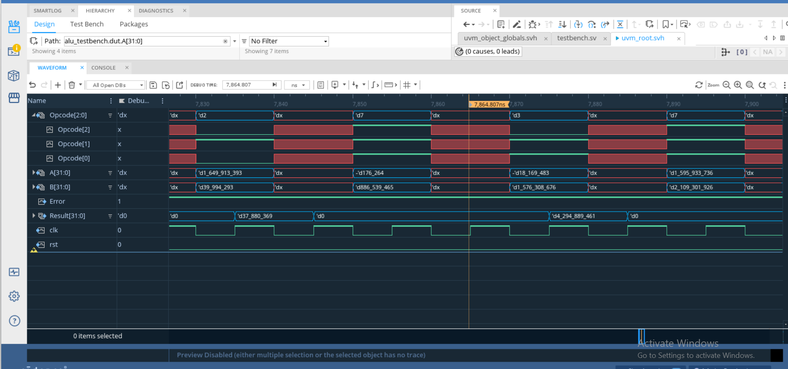
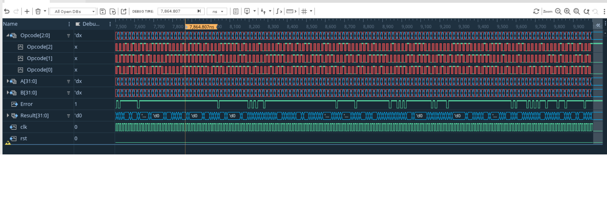

⚙️ ALU Verification Project using UVM
🧩 Overview

This project implements a Universal Verification Methodology (UVM) testbench to verify an Arithmetic Logic Unit (ALU) design.
The ALU supports multiple operations such as:

Addition ➕

Subtraction ➖

AND operation 🟩

OR operation 🟨

XOR operation 🟪

The testbench generates randomized transactions to test all ALU functionalities and ensure correctness using UVM components such as:

sequence_item, driver, monitor, agent, scoreboard, and subscriber

.
.
.

🧠 UVM Components Structure
project/
│
├── alu.sv                      # ALU Design (DUT)
├── alu_interface.sv            # Interface connecting DUT and TB
│
├── alu_sequence_item.sv        # Transaction item
├── alu_driver.sv               # Drives inputs to DUT
├── alu_monitor.sv              # Monitors signals from DUT
├── alu_sequencer.sv            # Controls the sequences
├── alu_agent.sv                # Wraps driver, sequencer, and monitor
├── alu_scoreboard.sv           # Compares DUT output with expected result
├── alu_subscriber.sv           # Coverage collector
├── alu_environment.sv          # Top-level testbench environment
│
├── alu_add_sequence.sv         # Sequence for ADD operation
├── alu_sub_sequence.sv         # Sequence for SUB operation
├── alu_and_sequence.sv         # Sequence for AND operation
├── alu_or_sequence.sv          # Sequence for OR operation
├── alu_xor_sequence.sv         # Sequence for XOR operation
│
├── alu_sequence.sv             # Random sequence for mixed operations
├── alu_random_test.sv          # Main test (runs random sequence)
│
└── testbench.sv                # Top-level testbench module

🧪 Simulation Command

To run the UVM testbench with Cadence Xcelium (xrun), use the following command:

xrun -sv -uvm -access +rw \
     alu.sv \
     alu_interface.sv \
     alu_sequence_item.sv \
     alu_driver.sv \
     alu_monitor.sv \
     alu_sequencer.sv \
     alu_agent.sv \
     alu_scoreboard.sv \
     alu_subscriber.sv \
     alu_environment.sv \
     alu_add_sequence.sv \
     alu_sub_sequence.sv \
     alu_and_sequence.sv \
     alu_or_sequence.sv \
     alu_xor_sequence.sv \
     alu_sequence.sv \
     alu_random_test.sv \
     testbench.sv \
     -debug_opts verisium_interactive

✅ Note:

Make sure each file has a proper timescale directive (e.g., `timescale 1ns/1ps).

Ensure your working directory includes all the .sv files.

The test name is alu_random_test.

📊 Coverage & Results

Functional Coverage: Collected through alu_subscriber.sv.

Scoreboard Checks: Validates actual vs expected ALU outputs.

Randomization: Achieved through UVM sequences for stress testing.

👨‍💻 Author

Aqdar Ahmed
🎓 Computer Engineering Student — AAUP
📧 [AAbusufyan@orionvtech.com]
📧 [a.abusufyan@student.aaup.edu]
